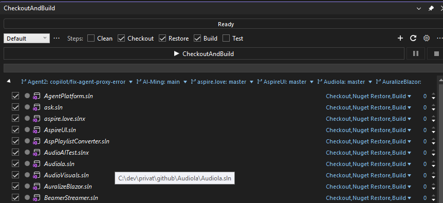

# CheckoutAndBuild

Local one-click CI for Visual Studio: keep any number of solutions up to date with a single click — clean, git checkout, NuGet restore, build and test, all out of process and in parallel. Plus a full git cockpit (changes, stashes, history, branches, worktrees, multi-repo sync) and Azure DevOps work item tools.

**Website:** https://fgilde.github.io/CheckoutAndBuild/ · **Marketplace:** https://marketplace.visualstudio.com/items?itemName=fgilde.CheckoutAndBuild



## Install

- **Visual Studio Marketplace**: search for "CheckoutAndBuild" in Extensions → Manage Extensions
- **Manual**: download the `.vsix` from the [latest release](https://github.com/fgilde/CheckoutAndBuild/releases) and double-click it

Requires Visual Studio 2022 or 2026 (amd64) and git on PATH.

## Features

### Pipeline
- Clean → Checkout (git pull) → NuGet restore → Build → Test for every included solution
- Solutions with the same build priority run in parallel; priority groups run in order
- "Suggest Build Priorities" scans cross-solution references and orders the build automatically
- Status bar with elapsed time and ETA, per-solution progress, "retry failed only"
- Build errors and test failures in the Visual Studio Error List, double-click jumps to code
- Script export (`.bat`/`.ps1`), scheduled runs, background-finish notification, taskbar progress
- Working profiles, per-branch settings, per-solution service/property/target overrides
- MEF plugin API: custom services, pre/post actions, build property providers, settings pages

### Git cockpit
- Changes with real VS diff, stage/unstage, commit & push, patch export/apply, zip export
- Stashes, filtered history with per-file follow, branches with ahead/behind badges
- Multi-repo sync, same-branch checkout across repositories, merged-branch cleanup, PR links
- Worktree manager: list, add, remove, prune — switch worktrees straight from the main window

### Azure DevOps
- Work item query view and search & replace across work item text fields (REST, PAT auth)

## JetBrains IDEs (Rider, IntelliJ, PhpStorm, …)

`JetBrains/` contains a platform plugin that works in **every** JetBrains IDE (it only depends on the core platform). It brings the one-click pipeline to polyglot codebases: working folders are scanned for .NET solutions, Gradle, Maven, npm, Composer, Cargo and Go projects; the pipeline runs git pull → install/restore → build → test per project, same-priority projects in parallel.

```
cd JetBrains
./gradlew buildPlugin        # zip lands in build/distributions/
```

Install via Settings → Plugins → ⚙ → Install Plugin from Disk. Each GitHub release also carries the plugin zip as an asset.

## Build from source

```
git clone https://github.com/fgilde/CheckoutAndBuild.git
msbuild VisualStudio/CheckoutAndBuild.VisualStudio/CheckoutAndBuild.VisualStudio.csproj /restore
dotnet test VisualStudio/CheckoutAndBuild.Core.Tests
```

The engine (`CheckoutAndBuild.Core`, netstandard2.0) is IDE-free and runs every step through external processes (git, msbuild via vswhere, vstest, nuget/dotnet).

## Release

Publishing a new version is a two-step process:

1. **GitHub release (automatic):** create a release with a tag like `v3.2.0` (or push the tag). The release workflow stamps the VSIX version from the tag, builds, runs all tests and attaches `CheckoutAndBuild-v3.2.0.vsix` to the GitHub release.
2. **Marketplace (one local command):** `.\publish-marketplace.ps1 -Version 3.2.0` — builds the VSIX with the stamped version and uploads it to the Visual Studio Marketplace using a short-lived Entra ID token from the local `az login` (no stored secrets). It verifies the expected account before doing anything.

The workflow's own marketplace step only activates when a `VS_MARKETPLACE_PAT` secret exists — kept as an option, not required.

## License

See [LICENSE](LICENSE). The previous generation of the extension lives under `Legacy/` for reference.
